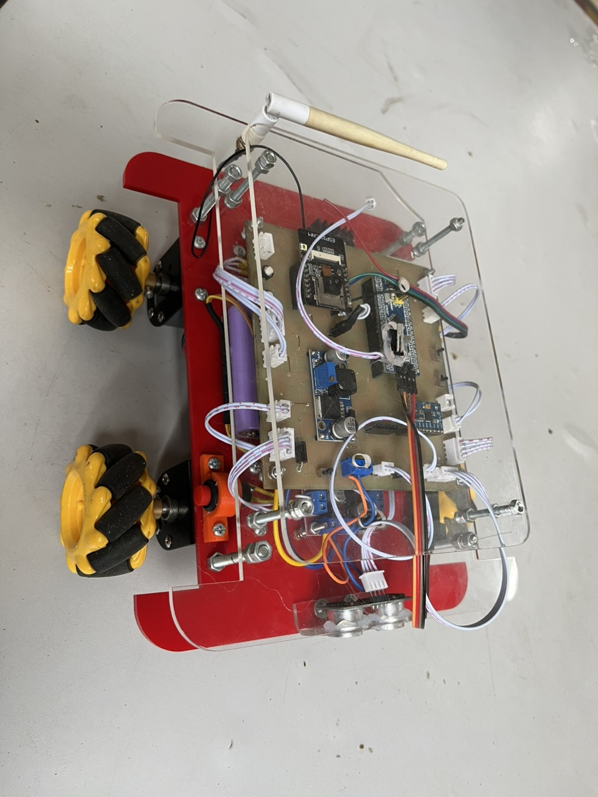
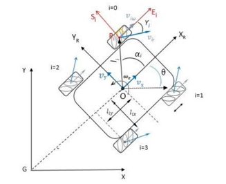
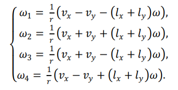
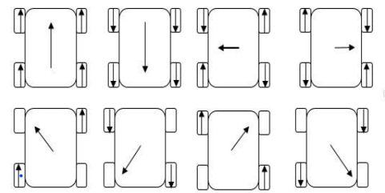

<h1 align="center">IOT Shipping Robot</h1>

# Project Title

Vectoring code for a IOT Shipping Robot written for Stm32 Microcontroller.  

## DC Motor Speed Control

Motor speed control using encoders. Encoder are connected to the hardware interrupt of the microcontroller(Stm32f103C8). A timer using the timming interrupt service routine is used to measure the motor rotation speed. System Identification is performed to approximate the DC motors as 2nd order system. PID controller is implemented for speed control. 

## Vectoring

X and Y vector (or Magnitude, Theta) are transformed to the three motor RPMs.

## High Level Control

### 1. Control via ESP8266 blynk app:

This functionality is added for the control of IOT Shipping Robot running your smart phone.

## Video demo

[Video Demo](https://www.youtube.com/shorts/IHfTx84aVUI)

Contact us if you have any problem

## Authors

Contributors names and contact info

- [Nguyễn Quang Ren](https://www.facebook.com/oithatlavuibietbaonhieu.uat) - Da Nang University of Technology
- [Bùi Duy Quốc](https://www.facebook.com/duy.quoc.77964) - Da Nang University of Technology
- [Phan Minh Thuận](https://www.facebook.com/thoi.ke.1029770) - Da Nang University of Technology
- [Phan Đình Vương](https://www.facebook.com/pdvuong7777444448.99933388.88) - Da Nang University of Technology

## Acknowledgments

- [Tuning a PID Controller with Genetic Algorithms](https://www.youtube.com/watch?v=S5C_z1nVaSg&t=2s)
- [PID Speed and PID position](http://arduino.vn/result/5401-pid-speed-position-control)
